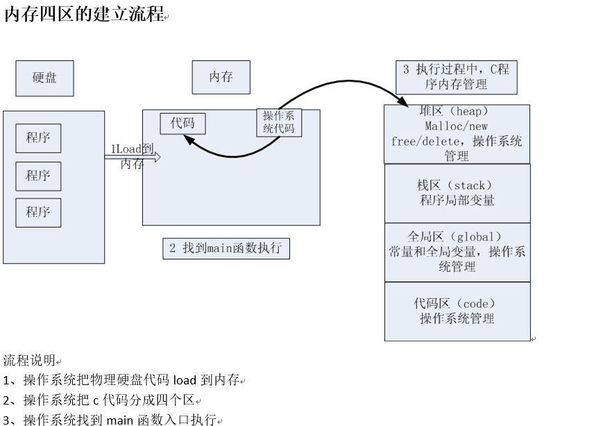

# c提高

建立正确的程序运行内存布局图是学好C语言的关键。

##  1 程序内存模型

###  数组当作参数时会退化为指针
```
static void passArray(int intArr[]) {
    int size = sizeof(intArr);//8
    printf("stack size = %d \n", size);
}


static void array() {
    int intArr[10];
    int size = sizeof(intArr);//40
    printf("stack size = %d \n", size);
    passArray(intArr);
}
```


###  数据类型的本质

数据类型可以理解为创建变量的一个模具，是固定内存块大小的别名，通过`sizeof`测试。
其作用是让编译器预算对象分配内存空间的大小。

变量是既能读又能写的内存对象，其本质是一段连续内存空间的别名。
程序通过变量来申请和命名内存空间` int a = 0`，变量三要素(名称、大小、作用域)。

指针也是一种数据类型。指针变量也是一种变量，指针指向谁就把谁的地址赋值给指针。

```
int a = 10;     //4个字节
int b[10];      //4*10个字节，&b表示取整个数组的首地址，也就是40个字节
printf("%p, %p, %p, %p ", &a, &a+1, &b, &b+1);//&a+1加了4，&b+1加了40
```

### sizeof

`sizeof`是操作符，不是函数；`sizeof`测量的实体大小为编译期间就已确定

### void类型

- 当函数的无参数时，int fun(void);
- 当函数无返回值时，void fun(int a);
- 不能定义void类型变量，因为void表示没有类型，所以无法确定内存的大小
- 可以定义`void *`类型，指针类型的大小是固定的
- `void *`是万能指针，用于函数参数，返回值等等
- `void *`用作数据类型封装，典型的如内存操作函数malloc：`void *__cdecl malloc(size_t _Size);`
- `void *`在使用时应该转换为实际类型的指针

### pragma once

```
#progam once //可用于头文件中，防止头文件重复包含
```

### 内存四区

- 堆区
- 栈区
- 全局区、文字常量区
- 代码区



绘制内存四区图来分析程序内存分配


### 函数的调用模型 

- 函数的模型是一个栈的模型，先进后出
- 关心函数调用顺序，函数内部变量的作用域，不关心出栈进栈
- 函数结束后，变量是否还存在内存中
- 主调函数在栈空间分配的内存，在其后面的调用的子函数都可以使用


### 内存的生长方向

- 栈的生长方向是高位到地位
- 堆的生长方向是低位到高位
- 注意：栈中声明的一个数组buf，`buf+1`顺序永远是由低位到高位分配

---
## 2 指针知识体系搭建

以指针变量`*p`为例说明

### 2.1 指针是一种数据类型

- 指针也是一种变量，占有内存空间，用来保存内存地址，32位系统指针占4个字节，64位系统指针占8个字节
- `*p`操作内存
    - 在指针**声明**时，*号表示所声明的变量为指针
    - 在指针**使用**时，*号表示操作指针所指向的内存空间中的值
    - `*p`相当于通过地址(p变量的值)找到一块内存；然后操作内存
    - `*p`放在等号的左边赋值（给内存赋值）
    - `*p`放在等号的右边取值（从内存获取值）
- 指针变量和它指向的内存块是两个不同的概念
    - 给p赋值`p=0x1111`; 只会改变指针变量值，不会改变所指的内容：`p = p +1`;
    - 给`*p`赋值`*p='a'`; 不会改变指针变量的值，只会改变所指的内存块的值
    - `=`左边`*p`表示给内存赋值，`=`右边`*p`表示取值，含义截然不同
- 使用指针修改变量时，保证所指的内存块是能修改的
- 指针的数据类型，是指它指向的内存空间的数据类型，数据类型决定了**指针步长(p++)**，步长根据所指内存空间的数据类型来确定
    - `int *p;  p++;` 移动了4个字节
    - `char *p; p++;` 移动了1个字节

建立指针指向谁，就把把谁的地址赋值给指针


### 2.2 间接赋值（*p）是指针存在的最大意义

`*p`间接赋值成立条件：

- 2个变量（一个实参，一个形参）
- 建立关系，实参取地址赋给形参指针
- `*p`形参去间接修改实参的值

```c
int iNum = 0;// 条件一：两个变量
int *p = NULL;
p = &iNum;// 条件一：两个变量
*p = 1;// 条件三：通过* 操作符， 间接的给变量内存赋值
```

函数调用时，用`n`级指针(形参)改变`n-1`级指针(实参)的值。


### 2.3 理解指针必须和内存四区概念相结合

主调函数与被调函数 

- 主调函数可把堆区、栈区、全局数据内存地址传给被调用函数
- 被调用函数只能返回堆区、全局数据
    
内存分配方式

- 指针做函数参数，是有输入和输出特性的。
- 函数返回普通变量和指针变量的本质是一样的，问题在于返回后的指针变量所指向的内存是还可以使用。

### 2.4 应用指针必须和函数调用相结合——指针做函数参数

指针做函数参数，问题的实质不是指针，而是看指针指向的内存块。
理清是主调函数还是被调用函数分配内存；被调用函数是在`heap/stack`上分配内存。

- 一级指针做输入
- 一级指针做输出
- 二级指针做输入
- 二级指针做输出


### 2.5 避免错误

- 避免野指针
- 必要时才使用`malloc/new`
- 不允许向NULL和未知非法地址拷贝内存。

---
## 3 字符串和一级指针内存模型

1. 在C语言中使用字符数组来模拟字符串
2. C语言中的字符串是以`\0`结束的字符数组
3. C语言中的字符串可以分配于栈空间，堆空间或者只读存储区


### 字符串的初始化

数组初始化有2种方： 默认元素个数、指定元素个数

```c
int sample1(){	
    //若没有指定长度，默认不分配零
    `char buf1[] = {'a', 'b', 'c', 'd', 'e'};`
    
    //若指定长度，不够报错；buf长度多于初始化个数，会自动补充零
    char buf2[6] = {'a', 'b', 'c', 'd', 'e'};
    char buf3[6] = {'a', 'b', 'c', 'd', 'e'};
    char buf4[5] = {'a', 'b', 'c', 'd', 'e'};
    char buf5[100] = {0};//所有元素赋值为0
    
    //测试
    printf("buf3:%s", buf3);//乱码，为什么？
    system("pause");
}


int sample2(){
	//用字符数组来初始化数组，主动补0
	char buf2[] = {'a', 'b','c','d','\0'};

	//字符串常量初始化一个字符数组，会自动补充零
	char buf3[] = {"abcde"};
	char buf4[] = "abcde";//"abcde"从字符串常量区拷贝到栈区
	char buf5[100] = "abcde";  
	char *buf6 = "abcde";//"abcde"在字符串常量区

	printf(" strlen(buf5) :%d \n", strlen(buf5));
	printf(" sizeof(buf4) :%d \n", sizeof(buf5));
	printf(" sizeof(buf4) :%d \n", sizeof(buf4));	
}
```

- `strlen()`：求字符串的长度，注意字符串的长度不包含`\0`
- `sizeof(类型)`：字符串类型的大小，包括`\0`
- `\0129`：转义字符，相当于`\n9`
- 不要混淆空字符` `和0字符`\0`
- 数字`0`和`'\0'`等价

### 字符串做函数参数

指针和数组的区别：

- 指针是变量，初始化后可以指向其他字符串
- 数组是常量，初始化后不能被再次赋值
- `char *p = "abcd";`，abcd是字符串常量，不可修改
- `char p[] = "abcd";`，abcd在栈中，可修改
 
为什么栈中的字符数组不能做如下修改？
```
int sample(){
    char buf[] = "abce;
    buf ++;
}
```
不能，因为栈中的内存分配在编译期就已经确定了，然后栈中内存的回收也是按照这个值去回收的，而栈中的数组分配到栈中的，
所以如果能够改变栈中数组，栈中的内存占用也会发生改变，这就导致栈中内存无法正常的回收。

### 模拟`strcpy`函数

```c
int copy_str(const char *src, char *dest){
    
    //不要直接使用形参
    char *from = src;
    char *to = dest;

	if (from==NULL || to==NULL){
		printf("func copy_str05_good() err. (from==NULL || to==NULL)\n");
		return -1;
	}

	while( (*to++=*from++) !='\0');

	return 0;
}
```

指针作为函数的参数：

- 判断形参指针是否为空
- 不要直接使用形参

### 一级指针(char *)常见使用错误

对空字符串和非法字符串的判断
```
void copy_str(char *from, char *to){

    //这样判断没有效果，使用from == NULL
    if (*from == '\0' || *to == '\0'){
        printf("func copy_str() err\n");
        return;
    }

    for (; *from!='\0'; from++, to++){
        *to = *from;
    }
    *to = '\0';
}
```
指针的叠加会不断改变指针的方向
```
    char *a = (char *)malloc(50);
    a++;
    free(a);//释放错误
}   
```
返回局部指针变量

### const

const的使用，对于指针变量：

- 从左往右看，跳过类型，看修饰哪个字符
- 如果是`*`， 说明指针指向的内存不能改变
- 如果是指针变量，说明指针的指向不能改变，指针的值不能修改
- 在c语言中, const是一个冒牌货，通过指针可以间接的修改const变量

```
int main(void){
	//const修饰一个变量为只读
	const int a = 10;
	//a = 100; //err

	//指针变量， 指针指向的内存， 2个不同概念
	char buf[] = "aklgjdlsgjlkds";

	//从左往右看，跳过类型，看修饰哪个字符
	//如果是*， 说明指针指向的内存不能改变
	//如果是指针变量，说明指针的指向不能改变，指针的值不能修改
	const char *p = buf;
	// 等价于上面 char const *p1 = buf;
	//p[1] = '2'; //err
	p = "agdlsjaglkdsajgl"; //ok

	char * const p2 = buf;
	p2[1] = '3';
	//p2 = "salkjgldsjaglk"; //err

	//p3为只读，指向不能变，指向的内存也不能变
	const char * const p3 = buf;

	//如何引用另外.c中const变量，了解
	extern const int aa; //不能再赋值，只能声明
	printf("aa = %d\n", aa);

	//const修饰的变量，定义时就要初始化

	//在c语言中, const是一个冒牌货
	const int b = 10;
	//b = 100; //err
	int *q = &b;
	*q = 22;
	printf("%d, %d\n", b, *q);

	return 0;
}
```

### 合理的利用const

- 指针做函数参数，可以有效的提高代码可读性，减少bug；
- 清楚的分清参数的输入和输出特性


---
## 4 二级指针

二级指针基本概念：如果一个指针变量存放的又是另一个指针变量的地址，则称这个指针变量为指向指针的指针变量。也称为“二级指针”。
通过指针访问变量称为间接访问。由于指针变量直接指向变量，所以称为“一级指针”。而如果通过指向指针的指针变量来访问变量则构成“二级指针”。 

- 二级指针输出特性(作为函数的参数)
- 二级指针输入特性(作为函数的参数)


---
##  5 多维数组

数组指针与指针数组

多位数组的本质


---
## 引用

- [博学谷](http://yun.itheima.com/)