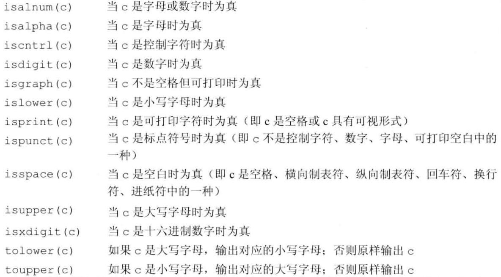

除了内置类型外，C++语言还提供了一些丰富的抽象数据类型库。比如

- string：支持可变长字符串
- vector：表示可变长集合
- 内置数组

---
# C++字符串

C++ 提供了以下两种类型的字符串表示形式：

- C 风格字符串
- C++ 引入的 string 类类型

---
## C 风格字符串

C 风格的字符串起源于 C 语言，并在 C++ 中继续得到支持。字符串实际上是使用 null 字符 '\0' 终止的一维字符数组。因此，一个以 null 结尾的字符串，包含了组成字符串的字符。

c中有大量的函数用来操作以 null 结尾的字符串。

```
strcpy(s1, s2); 作用为：复制字符串 s2 到字符串 s1。
strcat(s1, s2); 作用为：连接字符串 s2 到字符串 s1 的末尾。
strlen(s1); 作用为：返回字符串 s1 的长度。
strcmp(s1, s2); 作用为：如果 s1 和 s2 是相同的，则返回 0；如果 s1<s2 则返回值小于 0；如果 s1>s2 则返回值大于 0。
strchr(s1, ch); 作用为：返回一个指针，指向字符串 s1 中字符 ch 的第一次出现的位置。
strstr(s1, s2); 作用为：返回一个指针，指向字符串 s1 中字符串 s2 的第一次出现的位置。
```

---
## C++标准库中string

标准库中的string表示可变长的字符序列。string支持上述c中所有的字符串操作，另外还增加了其他更多的功能。

对于string，需要掌握以下内容

- 定义和初始化字符串
- 直接初始化与拷贝初始化
- 字符串的操作
- 操作字符串的单个字符

c++中的字符串是可变的，我们能改变字符串中的字符，在cctype头文件中定义了一组标准的库函数用用于处理和判断字符。如下表所示：


>图来自：c++ primer


### size_type类型
 
 字符串的size方法返回的类型是`string::size_type`，这在c++中很常见，string类和其他标准库类型都定义了几种配套类型，这些配套类型体现了与机器无关的特性，
 size_type就是其中一种，size_type是一种无符号类型，且保证其长度可以容纳string的size。

---
## 3 使用c++标准的头文件

C++的标准库处理定义C++的特有的特性外，也兼容了c语言标准库，c语言的头文件形如`name.h`,则c++将这个头文件命名为`cname`,
也就是去掉了.h后缀，在前面加上了c前缀，这里的c表示这是一个属于c语言的标准库头文件。    一般来说，我们应该使用名为`cnamecname`的头文件。
比如处理字符时，应该引入`cctye`而不是`ctype.h`。