# 数据结构和算法

---
## 1 数据结构概念

数据结构主要研究非数值计算问题的程序中的操作对象以及他们之间的关系，不是研究复杂的算法。数据结构是计算机存储、组织数据的方式。

数据结构中的基本概念：

- 数据：程序的操作对象，用于描述客观事物，数据是一个抽象的概念，将其进行分类后得到程序设计语言中的类型。如int、float、char等等。
- 数据元素：组成数据的基本单位。
- 数据项：一个数据元素由若干数据项组成。
- 数据对象：性质相同的数据元素的集合（比如数组、链表）。

```c
//声明一个结构体类型
struct Teacher//一种数据类型
{   charname[32];
    chartile[32];
    intage;charaddr[128];
};

int main(){
    struct Teacher1;//数据元素
    struct TeacherArray[30];//数据对象
    memset(&t1,0,sizeof(t1));
    strcpy(t1.name,"name");//数据项
    strcpy(t1.addr,"addr");//数据项
    strcpy(t1.tile,"addr");//数据项
    t1.age=1;
}
```

### 分类

数据结构可分为四类：集合、线性结构、树形结构、图形结构

- 线性结构举例：数组、链表、队列、栈
- 树形结构举例：二叉树、平衡树、排序树等
- 图形结构举例：有向图、无向图等

按照逻辑分类，数据结构又可以分为线性结构和非线性结构

按照存储方式分类，又可以分为顺序存储、链式存储、索引存储、散列存储

### 程序设计

用编程语言实现各种数据结构，针对每一种数据结构提供常用的操作方法，如插入、查找等。


---
## 2 算法概念

为什么我们学习数据结构还要了解算法？

比如说：有10个学生，我们将是10个学生保存在一个链表中，但是我不能把学生保存进去就完事了吧？我放进去是为了使用这些个数据完成一定的业务需求，
比如按成绩大小排序并显示，比如计算这些学生的平均分等等，这些才是我们最终要解决的问题，既然要解决问题，那么就需要一些算法，比如排序算法，比如计算平均分的算法，
所以数据结构和算法是互相配合完成工作。

算法是特定问题求解步骤的描述，在计算机中表现为指令的有限序列，算法是独立存在的一种解决问题的方法和思想。对于算法而言，语言并不重要，重要的是思想。

- 数据结构只是静态的描述了数据元素之间的关系，高效的程序需要在数据结构的基础上设计和选择算法
- 算法是为了解决实际问题而设计的。
- 数据结构是算法需要处理的问题载体。
- 数据结构与算法相辅相成
- 算法特性：输入、输出、有穷性、确定性、可行性
    - 有穷性：算法在有限的步骤之后会自动结束而不会无限循环，并且每一个步骤可以在接受的实际内完成
    - 确定性：算法中的每一步都有确定的含义，不会出现二义性
    - 可行性：算法的每一步都是可行的，也就是说每一步都能够执行有限的次数完成

### 算法效率的度量

#### 事后统计法

主要通过设计好的测试程序和数据，利用计算机的计时器对不同算法的编制的程序的运行时间进行比较，从而确定算法效率的高低。

- 统计方法：比较不同算法对同一组输入数据的运行处理时间。
- 缺陷：为了获得不同算法的运行时间必须编写相应程序；运行时间严重依赖硬件以及运行时的环境因素；算法的测试数据的选取相当困难
- 总结：事后统计法虽然直观，但是实施困难且缺陷多

#### 事前分析估算

在计算机程序编制前，依据统计方法对算法进行估算

- 统计方法：依据统计的方法对算法效率进行估算
- 影响算法效率的主要因素：算法采用的策略和方法、问题的输入规模、编译器所产生的代码、计算机执行速度

算法推倒的理论基础：

1. 算法最终编译成具体的计算机指令
1. 每一个指令，在具体的计算机上运行速度固定
1. 通过具体的步骤，就可以推导出算法的复杂度

怎么判断一个算法的效率：

- 判断一个算法的效率时，往往只需要关注操作数量的最高次项，其它次要项和常数项可以忽略。
- 在没有特殊说明时，我们所分析的算法的时间复杂度都是指最坏时间复杂度。
- 只有常数项记做1
- 操作数量的估算可以作为时间复杂度的估算

### 算法的时间复杂度：大O表示法

常见的时间复杂度

执行次数函数 | 阶 | 非正式术语
---|---|--- |
12 | O(1) | 常数阶
2n+3 | O(n) | 线性阶
3n2+2n+1 | O(n2) | 平方阶
5log2n+20 | O(logn) | 对数阶
2n+3n*log2n+19 | O(nlogn) | nlogn阶
6n3+2n2+3n+4 | O(n3) | 立方阶
2^n |O(2^n) | 指数阶


常用的时间复杂度所耗费的时间从小到大依次是：
```
O(1)<O(logn)<O(n)<O(nlogn)<O(n^2)<O(n^3)<O(2^n)<O(n!)<O(n^n)
```
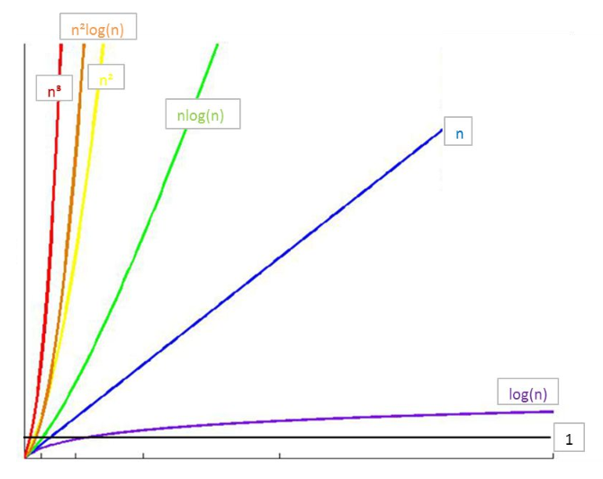

总结：

- 只关注最高次项
- 时间复杂度是指最坏时间复杂度
- 只有常数项记做1

算法的空间复杂度：算法的空间复杂度并不是计算所有算法所占的空间，而是使用的辅助空间的大小。

---
## 3 线性表

线性表是零个或者多个数据元素的有限序列。

特性：
- 数据元素之间是有顺序的
- 数据元素个数是有限的
- 数据元素的类型必须相同

线性表的操作：
- 创建线性表
- 销毁线性表
- 清空线性表
- 将元素插入线性表
- 将元素从线性表中删除
- 获取线性表中某个位置的元素
- 获取线性表的长度

### 3.1  数学定义

线性表是具有相同类型的n（≥0）个数据元素的有限序列（a0,a1,a2,...,an）ai是表项，n是表长度。

- a0为线性表的第一个元素，只有一个后继。
- an为线性表的最后一个元素，只有一个前驱。
- 除a0和an外的其它元素ai，既有前驱，又有后继。
- 线性表能够逐项访问和顺序存取。

### 3.2 线性表的顺序存储

指的是用一段地址连续的存储单元依次存储线性表的数据元素。

优点：
- 无需为线性表中的逻辑关系增加额外的空间。
- 可以快速的获取表中合法位置的元素。

缺点：
- 插入和删除操作需要移动大量元素。
- 当线性表长度变化较大的时候，难以确定存储空间的容量。


### 3.3 线性表的链式存储

为了表示每个数据元素与其直接后继元素之间的逻辑关系，每个元素除了存储本身的信息外，还需要存储指示其直接后继的信息。

优点：
- 无需一次性定制链表的容量
- 插入和删除操作无需移动数据元素

缺点：
- 数据元素必须保存后继元素的位置信息
- 获取指定数据的元素操作需要顺序访问之前的元素

链表中概念：

- 头结点：链表中的第一个结点，包含指向第一个数据元素的指针以及链表自身的一些信息
    - 头节点中的数据域可以存储链表长度等额外的信息，也可以不存储任何信息
    - 头结点即链表中的第一个节点（注意头节点不同于第一个元素），而头指针则是指向头结点的指针（有头结点的情况下）。任何一个链表实现中，可以没有头结点，但是不能没有头指针。
    - 链表可以没有头节点，此时头指针直接指向链表中的第一个元素
- 数据结点：链表中代表数据元素的结点，包含指向下一个数据元素的指针和数据元素的信息
- 尾结点：链表中的最后一个数据结点，其下一元素指针为空，表示无后继

#### 单链表

- 线性表的链式存储结构中，每个节点中只包含一个指针域，这样的链表叫单链表
- 通过每个节点的指针域将线性表的数据元素按其逻辑次序链接在一起
- 单向链表有两个域：数据和执行下一个节点的指针

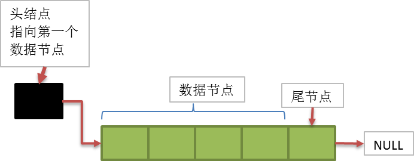

#### 链表技术领域推演

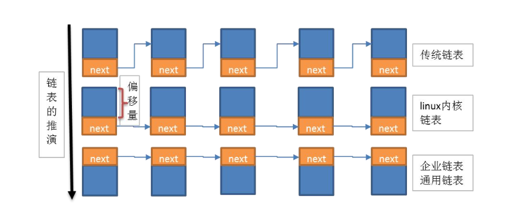

- Linux内核链表：数据放在结点上面，指针引用放在结点下面
- 企业链表：数据放在结点下面，指针引用防止结点上面

企业链表是Linux内核链表的改进版。

#### 循环链表

链表中最后一个结点的指针域指向头结点或则第一个元素结点，整个链表形成一个环。

下面是最后一个结点的指针域指向第一个元素结点的是图示：

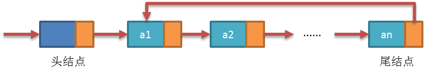

##### 循环链表设计与实现

插入元素分析：

- 普通插入元素

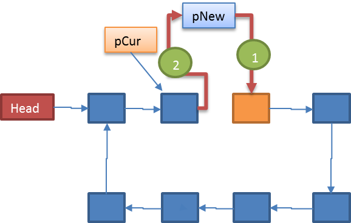

- 尾插法：最后一个结点的next指针指向新添加的结点，新结点的next指向第一个结点

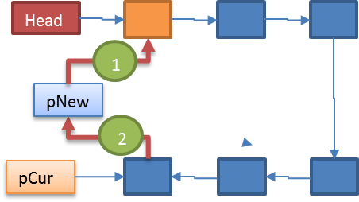

- 头插法：新节点指向当前的第一个结点，尾结点指向新节点

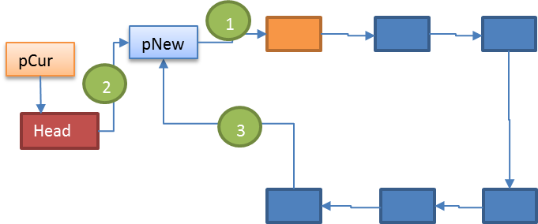

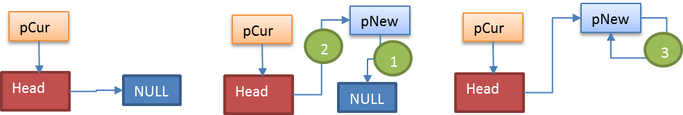

删除结点分析：

- 删除普通结点

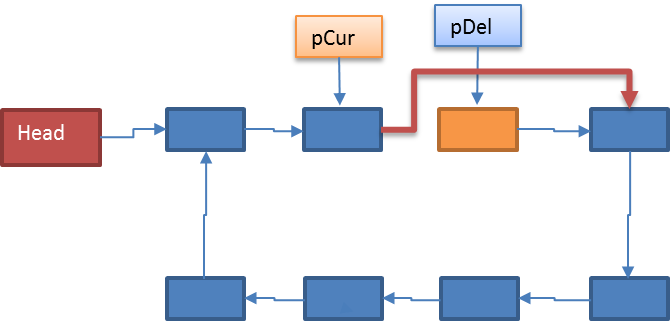

- 删除头结点(更新head结点，并且尾结点重新连接新的头结点)

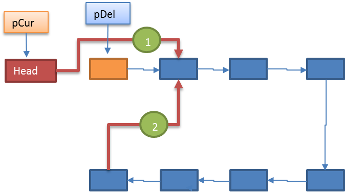


约瑟夫问题：约瑟夫问题（有时也称为约瑟夫斯置换），是一个出现在计算机科学和数学中的问题。在计算机编程的算法中，类似问题又称为约瑟夫环。
有n个囚犯站成一个圆圈，准备处决。首先从一个人开始，越过 k-2个人（因为第一个人已经被越过），并杀掉第k个人。
接着，再越过k-1个人，并杀掉第k个人。这个过程沿着圆圈一直进行，直到最终只剩下一个人留下，这个人就可以继续活着。


#### 双向链表

在单链表的结点中增加一个指向其前驱的pre指针

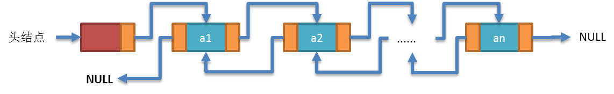

为什么需要双向链表？
- 单链表的结点都只有一个指向下一个结点的指针
- 单链表的数据元素无法直接访问其前驱元素
- 逆序访问单链表中的元素是极其耗时的操作！


---
## 4 受限线性表 

### 4.1 栈

栈的基本概念：首先它是一个线性表，也就是说，栈元素具有线性关系，即前驱后继关系。只不过它是一种特殊的线性表而已。定义中说是在线性表的表尾进行插入和删除操作，这里表尾是指栈顶，而不是栈底。
它的特殊之处在于限制了这个线性表的插入和删除的位置，它始终只在栈顶进行。这也就使得：栈底是固定的，最先进栈的只能在栈底。

- 栈的插入操作，叫做进栈，也成压栈。
- 栈的删除操作，叫做出栈，也有的叫做弾栈，退栈。

#### 栈的顺序存储

栈的顺序存储结构简称顺序栈，它是运算受限制的顺序表。顺序栈的存储结构是：利用一组地址连续的的存储单元依次存放自栈底到栈顶的数据元素，同时附设指针top只是栈顶元素在顺序表中的位置。

设计和实现：因为栈是一种特殊的线性表，所以栈的顺序存储可以通过顺序线性表来实现。

#### 栈的链式存储

栈的链式存储结构简称链栈，栈只是栈顶来做插入和删除操作，栈顶放在链表的头部还是尾部呢？
——由于单链表有头指针，而栈顶指针也是必须的，那干嘛不让他俩合二为一呢，所以比较好的办法就是把栈顶放在单链表的头部。另外都已经有了栈顶在头部了，
单链表中比较常用的头结点也就失去了意义，通常对于链栈来说，是不需要头结点的。

设计与实现：链栈是一种特殊的线性表，链栈可以通过链式线性表来实现。

#### 栈的应用

- 就近匹配
    - 当需要检测成对出现但又互不相邻的事物时可以使用栈“后进先出”的特性
    - 栈非常适合于需要“就近匹配”的场合
- 中缀表达式和后缀表达式
- 计算机如何基于后缀表达式计算

### 4.2 队列

队列是一种特殊的受限制的线性表，队列（queue）是只允许在一端进行插入操作，而在另一端进行删除操作的线性表。

队列是一种先进先出的（First In First Out）的线性表，简称FIFO。允许插入的一端为队尾，允许删除的一端为队头。队列不允许在中间部位进行操作！
假设队列是q=（a1，a2，……，an），那么a1就是队头元素，而an是队尾元素。这样我们就可以删除时，总是从a1开始，而插入时，总是在队列最后。
这也比较符合我们通常生活中的习惯，排在第一个的优先出列，最后来的当然排在队伍最后

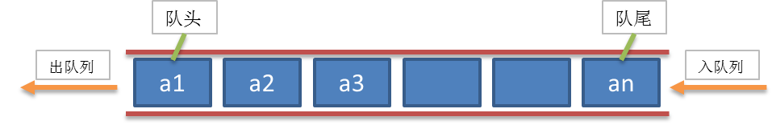

- 队列的顺序存储：队列是一种特殊的线性表；可以用线性表顺序存储来模拟队列。
- 队列的链式存储：队列是一种特殊的线性表；可以用线性表链式存储来模拟队列的链式存储。


---
## 5 树和二叉树

todo

---
## 6 排序

todo


