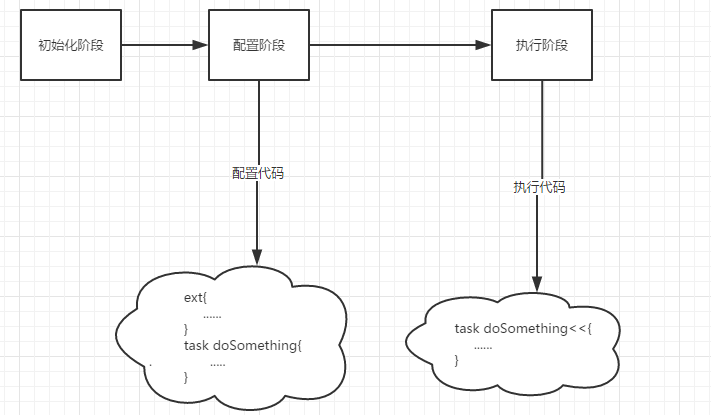
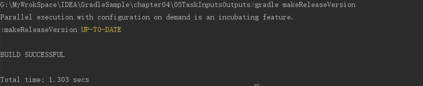
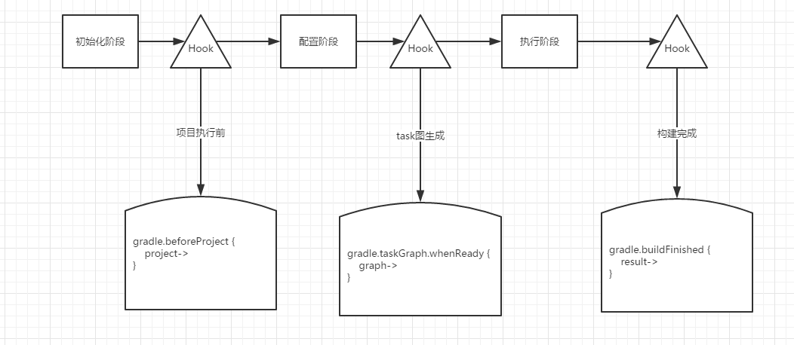

# 3 Task

一个Project可以包含一个或者多个task

task可以添加任务动作，任务动作定义了一个当任务执行时最小的工作单元。task之间可以定义依赖关系。

task的主要api：

```
        //task依赖
        Task dependsOn(Object... paths);

        //动作的定义
        Task doFirst(Action<? super Task> action);
        Task doFirst(Closure action);
        Task doLast(Action<? super Task> action);
        Task doLast(Closure action);
        List<Action<? super Task>> getActions();

        //输入和输出数据声明
        TaskInputs getInputs();
        TaskOutputs getOutputs();

        //getter/setter属性
        AntBuilder getAnt();
        Logger getLogger();
        boolean getEnabled();
        String getGroup();
        void setGroup(String group);
        void setDescription(String description);
        void setEnabled(boolean enabled);
```


<br/><br/>
## 3.1 定义属性

每个Project和Task实例都提供了可以通过setter/getter方法访问的属性，通过Gradle还支持扩展属性

添加扩展属性的方法：

1：使用project的ext

```
    ext{
        myValue1 = '001'
    }
    project.ext.myValue2='002'//只有在初始声明属性时才需要使用ext命名空间
    ext.myValue3 = '003'

    println myValue1//之后访问属性不需要使用ext命名空间
    println myValue2
    println myValue3
```

2：使用Gradle属性或项目属性

可以通过gradle.properties文件中声明属性。

- 在`$USER_HOME/.gradle/gradle.properties`中设置的属性，每一个构建的project实例都可以访问
- 在项目根目录下的`gradle.properties`中设置的属性，可以通过projcet来访问

示例：`gradle.properties`下定义acc变量：

    acc=1232

在构建脚本(`build.gradle`)中可以直接使用acc属性

    println project.acc
    println acc

3：通过命令行的方式来添加扩展属性

- 项目属性通过-P命令选项
- 系统属性通过-D命令选项
- 环境属性按照下面的模式提供:`ORG_GRADLE_PROJECT_propertyName=someValue`

示例：

    运行命令：gradle -Pabc=222     //-P为命令选项，abc=222为提供参数
    println abc   //在脚本中就可以访问abc属性了

<br/><br/>
## 3.2 使用Task


默认情况下每个新创建的Task都是`org.gradle.api.DefaultTask`类型的，标准的`org.gradle.api.Task`实现


### 项目版本管理

许多项目都有自己的版本管理策略，gradle中可以对version进行自定义配置

    //在脚本中设置version
    def projectVersion = new ProjectVersion()
    projectVersion.major =0//实际情况下，这些值可以放在配置文件中
    projectVersion.minor =1
    projectVersion.release = false
    version = projectVersion

    //定义一个来描述项目版本
    class ProjectVersion{

        int major
        int minor
        boolean release

        String toString() {
            "$major.$minor${release?'':'-SNAPSHOT'}"
        }

    }

### 声明task的动作和访问DefaultTask的属性


在脚本中使用`doFirst和doLast`为task添加动作，`doFirst和doLast的`本质其实就是类似容器的addFirst和addLast，每一个Task示例都维护者一个actin列表来保存这些动作

```groovy
    task Tas <<{
        println "第一任务"
    }

    Tas<<{
        println "第二任务"
    }
    Tas.doFirst{
        println "第三任务"
    }
    Tas.doFirst{
        println "第四任务"
    }
```

运行结果是：

    第四任务
    第三任务
    第一任务
    第二任务

访问属性：

```groovy
    task LogTest{
    //logger是Gradle提供的基于SLF4J的日志库
        logger.info 'info log'
        logger.log(LogLevel.ERROR, "ErrorMessage")//logger 是Proect的可访问属性
    }
    //配置task的group和description属性
    task taskPropSet(group: "test",description:"我就是测试一下设置属性"){
        println group
        println description
    }
    或者
     task taskPropSet(){
         group = "test"
         description = "我就是测试一下设置属性"
    }
```

### 定义task依赖与执行顺序

dependsOn方法允许声明依赖一个或多个task。


```groovy
task first<<{
    println 'first'
}
task second<<{
    println 'second'
}
task printVersion(dependsOn: [first,second] )<<{
    logger.quiet("version = $version")
}
task third <<{
    println 'third'
}
third.dependsOn('printVersion')
```

//运行task -q third的结果为：

     first
     second
     version = 1.0-SNAPSHOT
     third

从上面看到四个task的执行顺序，而first和second之间并没有依赖关系，为什么second没有在first之前运行呢？

**理解Gradle并不能保证task依赖的执行顺序是非常重要的**，dependsOn只是定义了所依赖的task要先执行，**Gradle的思想是声明一个给定task执行之前什么应该被执行，而没有定义它应该如何被执行**，执行顺序是由task的输入和输出规范自动确定的，这样设计的好处是：

- 不需要指定整个task依赖链上的关系是否发送改变
- 构建没有严格的执行顺序，即说明task支持并行执行


### 终结器task

Gradle提供的终结器task，即使终结器task失败了，Gradle的task也会按照预期执行。比如所以来的task执行后需要清理某种资源(不保证是否成功)。

    task aa{
        doLast{
            println 'A'
        }
    }

    task bb {
        doLast{
            println "B"
        }
    }

    aa.finalizedBy bb//声明一个task被另一个task终结

### mustRunAfter

mustRunAfter可以规定某个Task必须在另一Task运行后执行。


### 理解task的配置和Gradle构建生命周期

没有定义动作或者使用<<操作符添加的闭包，Gradle称之为**task配置**

    task taskConfig{
        println "task create"
    }

task的配置块永远在task执行动作之前被调用，为什么呢？我们需要理解Gradle构建声明周期：


**Gradle构建生命周期**：

无论什么时候执行gradle构建，都会执行三个不同的生命周期阶段：**初始化、配置阶段、执行**。




- 初始化阶段：Gradle为项目创建了一个Project实例，找出哪些项目依赖需要参与到构建中
- 配置阶段：Gradle构建一个模型来表示任务，并参与到构建中
- 执行阶段：所有的task都以正确的顺序被执行

**项目每一个构建的任何配置代码都可以被执行，即使你只执行`gradle tasks`**

### 声明task的inputs和outputs

Gradle通过比较两个构建task的inputs和outputs来决定task是否是最新的，如果inputs和outputs没有发生改变，则认为task是最新的，因此只有当input折outputs不同是时，task才会被执行，否则跳过此task

inputs可以是一个目录，一个或多个文件，或者是任意一个属性，一个task的输出是通过多个目录或1-n个文件来定义的。

```groovy
    ext.versionFile = file('version.properties')

    task loadVersion {
        project.version = readVersion()
    }

    task printVersion << {
        println "ProjectVersion = $version"
    }

    //用于描述项目Version
    class ProjectVersion {

        int major
        int minor
        boolean release

        String toString() {
            "$major.$minor${release ? '' : '-SNAPSHOT'}"
        }

    }


    task makeReleaseVersion(group: "versioning", description: "makes project a release version") {
        version.release = true

        inputs.property('release', version.release)
        outputs.file versionFile

        doLast {
            //ant task的property提供了一种便捷的方式来修改属性文件
            ant.propertyfile(file: versionFile) {
                entry(
                        key: 'release', type: 'string', operation: '=', value: 'true'
                )
            }
        }
    }

    ProjectVersion readVersion() {

        File file = versionFile
        if (!file.exists()) {
            throw new GradleException("file not exists :${file.canonicalPath}")
        }
        Properties versionProp = new Properties()
        file.withInputStream {
            versionProp.load(it)
        }
        new ProjectVersion(
                major: versionProp.major.toInteger(),
                minor: versionProp.minor.toInteger(),
                release: versionProp.release.toBoolean()
        )

    }
```



当第二次执行makeReleaseVersion时，由于指定的inputs和outputs没有发生改变，所以task被跳过执行。这一特性在优化构建速度上很有用


### 编写和使用自定义Task

自定义Task包含两个组件：

- 自定义的Task类，封装了逻辑行为，也被称作逻辑类型
- 真实的task，提供了用于配置行为的task所暴露的属性值

Gradle把这些称之为**增强的task**。

增强的task的优势是方便与单元测试，通过还增强了代码的可重用性


**编写自定义task类**


```groovy
    class MakeReleaseVersionTask extends DefaultTask{

        //通过注解声明task的输入/输出
        //@Input注解会在配置期间验证属性值，如果值为null，Gradle会抛出TaskValidationException，为了允许@Input为null，需要添加@Optional注解
        @Input
        boolean  release
        @OutputFile
        File destFile

        MakeReleaseVersionTask() {
            group = 'versioning'
            description="makes project a release version"
        }

        @TaskAction//使用注解声明将被执行的方法
        void start() {
            project.version.release = true
            ant.propertyfile(file: destFile){
                entry(
                        key: 'release', type: 'string', operation: '=', value: 'true'
                )
            }
        }
    }

  //定义了MakeReleaseVersionTask后就可以在build.gradle中使用了，使用方式为：
  task makeReleaseVersion(type:MakeReleaseVersionTask){
    release = version.release
    destFile = versionFile
  }

```


### Gradle的内置Task类型

Gradle内置了很多的Task类型，比如zip、delete、copy等，更多的task信息可以参考[task文档](https://docs.gradle.org/current/dsl/org.gradle.api.Task.html),Gradle内置的Task都是Default类型


```groovy

    task createDisribution(type: Zip, dependsOn: makeReleaseVersion) {//创建一个Zip类型的Task，

        from war.outputs.files//隐式的引用war的输出

        from(sourceSets*.allSource) {
            //*展开操作符 ，sourceSets的类型是DefaultSourceSetContainer_Decorated，是一个集合，元素为SourceSet
            //SourceSet 的allSource返回SourceDirectorySet
            into 'src'//把所有的源代码文件压缩到src
        }

        from(rootDir) {//包含版本信息
            include versionFile.name
        }
    }


    task backupReleaseDisribution(type: Copy) {//创建一个复制功能的task
        from createDisribution.outputs.files        //隐式的引用createDisribution的输出
        into "$buildDir/backup"
    }

    task release(dependsOn: backupReleaseDisribution) << {
        logger.quiet 'releasing the project'
    }
```

### Task的依赖推断

一般情况下task之间的依赖使用过dependsOn方法来指定的，但是一些task并不直接依赖其他task，比如上面createDisribution对war的依赖，Gradle根据一个Task的输出作为另一个task的输入可以推断出这两个task之间的依赖。


### Task的规则


**task规模命名模式**：Gradle也引入了task规则的概念，根据task名称模式执行特定的逻辑，该模式由两部分组成：**task名称的静态部分和一个占位符**，它们联合起来就组成了一个动态的task名称，类似下面添加版本号的`increment<Classifier>Version`


声明task规则需要调用TaskContainer的addRule方法，

```groovy
    tasks.addRule("Pattern: increment<Classifier>Version - Increments the project version classifier.") {

        String taskName ->
            if (taskName.startsWith('increment') && taskName.endsWith('Version')) {

                task(taskName) << {

                    String classifier = (taskName - 'increment' - 'Version').toLowerCase()

                    String currentVersion = version

                    switch (classifier) {
                        case 'major':   version.major ++
                            break
                        case 'minor':   version.minor++
                            break
                        default:
                            throw new GradleException("not supprot ")
                    }
                    String newVersion = version.toString()

                    logger.info "incrementing $classifier project version: $currentVersion -> $newVersion"

                    ant.propertyfile(file: versionFile) {
                        entry(
                                key: classifier, type: 'int', operation: '+', value: 1
                        )
                    }
                }

            }
    }
```

执行`gradle tasks`执行gradleincrementMajorVersion

task规则实践：Gradle的一些核心插件充分的利用了Task规则，java插件定义的规则之一是`clean<TaskName>`，用来删除指定的task输出。比如运行 `gradle cleanCompileJava`。


### 在buildSrc目录下构建代码

上面构建代码`ProjectVersion，ReleaseVersionTask`最适合移动到项目的buildSrc目录下，将构建代码放在buildSrc下面是一个良好的软件开发实践。


<br/><br/>
## 3.3 挂载构建生命周期


作为一个脚本构建开发人员，不能仅仅心限于编写在不同阶段执行task动作或者配置逻辑，有时候当一个特定的生命周期事件发生时可能想要执行代码，一个生命周期事件可能发生在构建阶段之前、之后、期间。

有两种方式可以编写回调生命周期事件：

- 在闭包中
- 通过Gradle提供的API监听




许多的生命周期回调方法被定义在project和Gradle接口中，可以查看Gradle的文档


在配置时，Gradle决定了在执行阶段要执行的task顺序，task依赖关系被建模为一个有向无环图，一个先执行的task永远不会再此执行。


### 挂载到task执行图


示例：当执行tast relase部署项目时,修改versin中的release为true

```groovy

    /*
    Represents an invocation of Gradle.
    You can obtain a Gradle instance by calling Project.getGradle().
    */
    gradle.taskGraph.whenReady { TaskExecutionGraph taskGraph ->
        println '-----------------------------------'
        println taskGraph
        println '-----------------------------------'

        if (taskGraph.hasTask(release)) {
            if (!version.release) {
                version.release = true
                ant.propertyfile(file: versionFile) {
                    entry(key: 'release', type: 'string', operation: '=', value: 'true')
                }
            }
        }
    }
```


### 实现task执行图监听器

如果将监听器添加到构建脚本中，那么你就不能直接访问project实例了，但是可以使用task的getProject方法获取project，每一个task都确切的知道它们所属的Project。


示例：当执行tast relase部署项目时,修改versin中的release为true

```groovy
    class ReleaseVersionListener implements TaskExecutionGraphListener {
        static final String releaseTaskPath = ':release'

        @Override
        void graphPopulated(TaskExecutionGraph graph) {
            println "allTasks:$graph.allTasks"

            if (graph.hasTask(releaseTaskPath)) {
                List<Task> allTasks = graph.allTasks
                Task release = allTasks.find {
                    it.path == releaseTaskPath
                }
                Project project = release.getProject()

                if (!project.version.release) {
                    project.version.release = true
                    ant.propertyfile(file: versionFile) {
                        entry(key: 'release', type: 'string', operation: '=', value: 'true')
                    }
                }
            }
        }
    }

    def releaseVersionListener = new ReleaseVersionListener()
    gradle.taskGraph.addTaskExecutionGraphListener(releaseVersionListener)
```
