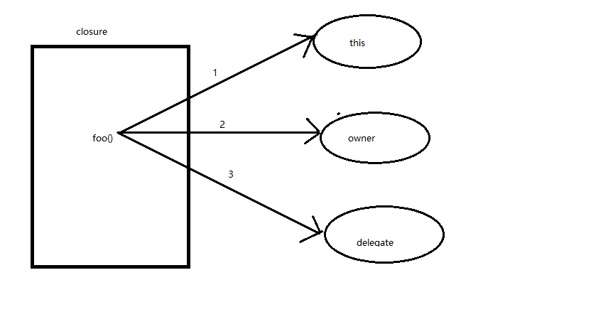
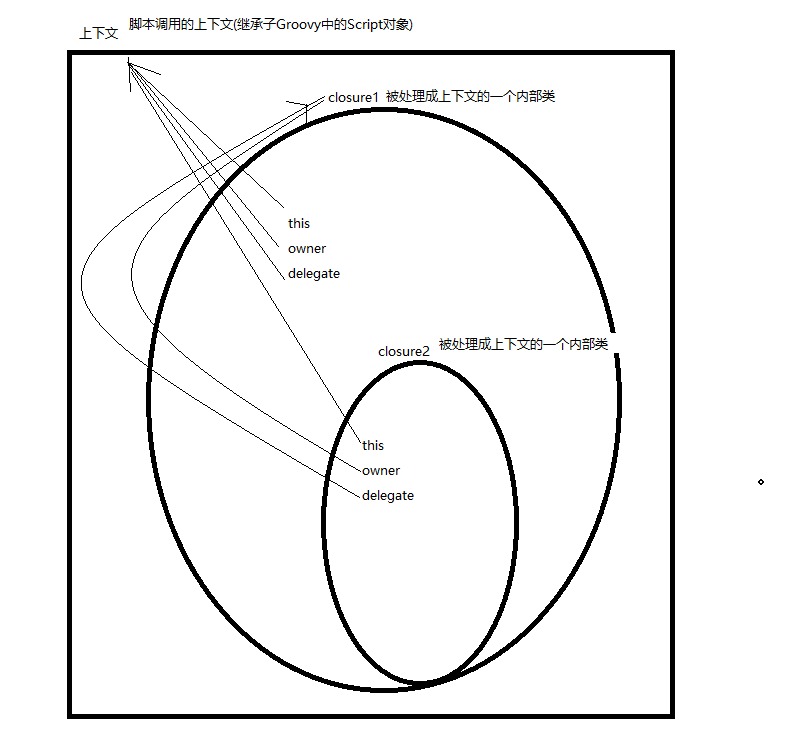

# 第四章：闭包

闭包是轻量级的、短小的、简洁的、而且将会是我们在Groovy中使用最多的特性之一，过去我们需要传递匿名内部类，现在我们可以传递闭包.

闭包是从函数式(一种编程规范，主要思想是把一些列运算写成一系列嵌套的函数调用)的Lambda表达式派生而来的，一个Lambda表达式指定了
一个函数的参数与映射)派生而来的

## 1 闭包的便利性

参考代码

##  2 闭包的应用

比好有两个擅长的领域：

1. 赋值清理资源
2. 赋值创建领域特定语言

普通函数在实现某个目标明确的功能时优于闭包，重构是引入闭包的好时机，闭包应该保持短小，有内聚性，应该把闭包设计为附到调用方法上的上的一小段代码，
最好不要乱用闭包的动态属性，比如在运行时确定参数的数目和类型。

## 3  闭包的使用方式

前面介绍了如何定义方法调用参数的参数时即时创建闭包，此外还可以将闭包赋值给变量

        def totalSelectValue(n, closure) {
            total = 0
            for (i in 1..n) {
                if (closure.call(i)) {
                    total += i
                }
            }
            total
        }
        
        def isOdd = {//闭包也不需要指明返回值，类似于方法
            it % 2 != 0
        }
        println totalSelectValue(20, isOdd)

## 4 闭包与协程

调用一个函数或方法会在程序的执行序列中创建一个新的作用域，我们会在一个入口点进入函数，在方法完成之后，回到调用者的作用域，
协程(Coroutine)则支持多个入口点，每个入口点都是上次挂起调用的位置，我们可以进入一个函数，执行部分代码后挂起，在回到调用的位置
的上下文或作用域内执行一个代码，之后我们可以在挂起的地方恢复该函数的执行，

        def iterate(n, closure) {
            1.upto(n) {
                println "in iterate with value $it"
                closure.call(it)
            }
        }
        
        total = 0
        iterate(10){
            total += it
            println "in closure total so fir is $total"
        }
        //每次调用闭包，我们都会从上次调用中恢复total的值

## 5 科里化闭包

带有预绑定形参的闭包叫做科里化闭包，当对一个闭包调用curry时，就是要求预先绑定某些形参，在预先绑定一个形参后，
调用这个闭包就没有必要为这个形参提供实参了。

        def tellFortunes(closure) {
            Date date = new Date()
            postFotrune = closure.curry(date)//预先绑定形参date
            postFotrune "you day is filled wih ceremony"
            postFotrune "they`re features , not bugs"
        }
        
        tellFortunes() {
            date, fortune ->
                println "fortune for $date is ${fortune}"//直接使用date
        }

可以使用curry方法科里化任意多个形参，但这些形参必须是从前面开始的若干个参数。也就是说，如果有n个形参，我们可以科里化前k个，其中0<=k<=n
如果要科里化形参中间的值，可以使用ncurry方法，传入要进行科里化的形参的位置和对应的值

## 6 动态闭包

可以确定一个闭包是否已经提供了，如果尚未提供，我们可以决定使用一个默认的实现来代替：

        def doSomthing(closure) {
            if (closure) {
                closure()
            } else {
                println "Using default implementation"
            }
        }
        
        doSomthing() {
            println "using specialized implementation"
        }

在传递参数是也很有灵活性，可以动态的确定一个表达所期望的参数的数目与类型：

    def completeOrder(amount, taxComputer) {

        tax = 0;
        if (taxComputer.maximumNumberOfParameters == 2) {
            //期望传入汇率 , maximumNumberOfParameters表示闭包接受的参数的个数
            tax = taxComputer.call(amount, 6.05)
        } else {
            tax = taxComputer.call(amount)
        }
    }
    
    println completeOrder(100) {
        it * 0.0825
    }
    println completeOrder(100) {
        amount, rate ->
            amount * (rate / 100)
    }

还可以使用parameterTypes属性或者getParameterTypes方法获知这些参数的类型：
​        
        def examine(closure) {
            println "$closure.maximumNumberOfParameters parameter(s) given:"
            for (aParameter in closure.parameterTypes) {
                println aParameter.name
            }
            println "--"
        }
        
        examine(){}
        examine() {
            it
        }
        examine() {
            val ->
        }
        examine() {
            Date val1 ->
        }
        examine() {
            Date val1, val2 ->
        }
        
        examine() {
            Date val1, String val2 ->
        }

即使一个闭包没有声明任何形参，就是{},{it},其实他也会接受一个参数，如果调用者没有向闭包提供任何值，则第一个形参it为null，如果希望闭包不接受任何参数，可以使用
{->}语法，在->之前没有任何形参.

## 7 闭包的委托

Groovy中的闭包远远超出了简单的匿名方法，Groovy闭包支持方法委托，而且提供了方法分派的能力，这点和JavaScript对原型继承的支持很像，

this、owner、delegate是闭包的三个属性，用于确定有哪个对象处理该闭包的方法调用，一般而言，delegate会设置为owner，但是对其加以修改
，可以挖掘出Groovy的一些非常好的元编程能力：

​        
            def examiningClosure(closure) {
                closure.call()
            }

            examiningClosure(){
                println "in first closure:"
                println "class is "+getClass().name
                println "this is "+this+", super: "+this.getClass().superclass.name
                println "owner is "+owner+" , super: "+owner.getClass().superclass.name
                println "delegate is "+delegate+" , super: "+delegate.getClass().superclass.name

                examiningClosure(){
                    println "in  closure    with the first closure:"
                    println "class is "+getClass().name
                    println "this is "+this+", super: "+this.getClass().superclass.name
                    println "owner is "+owner+" , super :"+owner.getClass().superclass.name
                    println "delegate is "+delegate+" , super: "+delegate.getClass().superclass.name
                }
            }
            //打印的结果为：
            in first closure:
            class is        ztiany.chapter4._006ClosureDelegate$_run_closure1
            this is          ztiany.chapter4._006ClosureDelegate@149e0f5d, super: groovy.lang.Script
            owner is       ztiany.chapter4._006ClosureDelegate@149e0f5d , super: groovy.lang.Script
            delegate is   ztiany.chapter4._006ClosureDelegate@149e0f5d , super: groovy.lang.Script
            
            in  closure    with the first closure:
            class is                    ztiany.chapter4._006ClosureDelegate$_run_closure1_closure2
            this is                      ztiany.chapter4._006ClosureDelegate@149e0f5d, super: groovy.lang.Script
            owner is                   ztiany.chapter4._006ClosureDelegate$_run_closure1@10e92f8f , super :groovy.lang.Closure
            delegate is               ztiany.chapter4._006ClosureDelegate$_run_closure1@10e92f8f , super: groovy.lang.Closure

上面打印了闭包的this、owner、delegate信息，由于第二个闭包是在第一个闭包中创建的，所以第一个闭包成了第二个闭包的owner
通过代码和打印信息说明：闭包被创建成了内部类，此外还说名，delegate被设置为owner，某些函数会修改闭包的delegate，比如with方法，闭包内
的this执行的是该闭包所绑定的对象(正在执行的上下文)，在闭包内引用的变量和方法都会绑定到this，他负责处理任何方法的调用，以及任何属性或变量的
访问，如果this无法处理，则转型owner，最后是delegate

我们无法修改owner属性，只能修改delegate属性。

设置闭包的delegate属性可能会导致副作用，尤其是闭包还用与其他函数和线程时，如果完全肯定该闭包不会用在别的地方，那自然可以设置delegate，如果闭包用在了
其他地方，则可以复制一个闭包，在副本上设置delegate，：

        def closure = {
            f1()
            f2()
        }
        def clone = closure.clone()
        new Example().foo {clone}
        
        //还可以更优化，加载with方法剋一次性完成这三个动作
        new Example().with closure(这里的闭包就会被clone)

## 8 使用尾递归编写程序

参考代码

## 9 使用记忆化改进性能

参考代码

