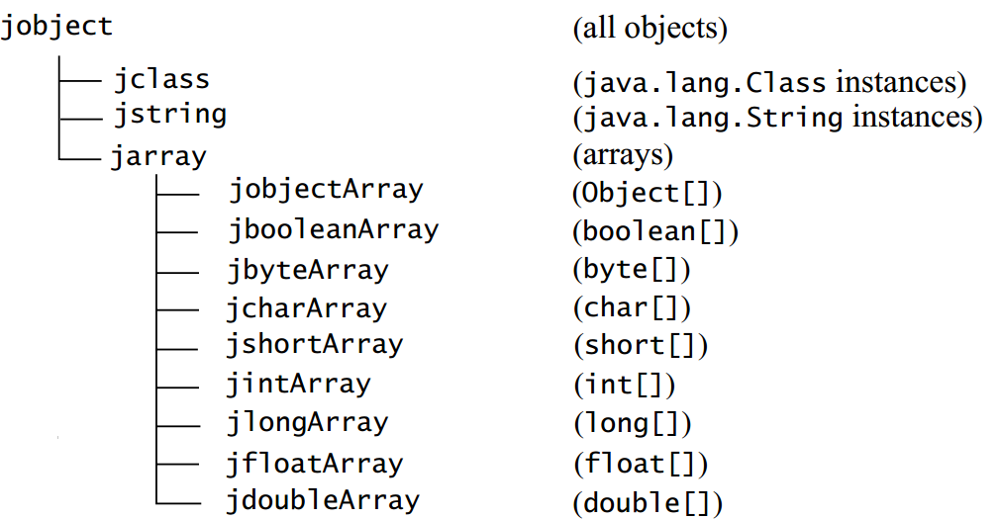
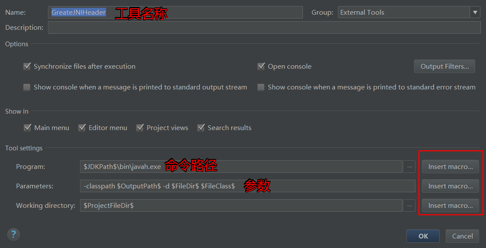
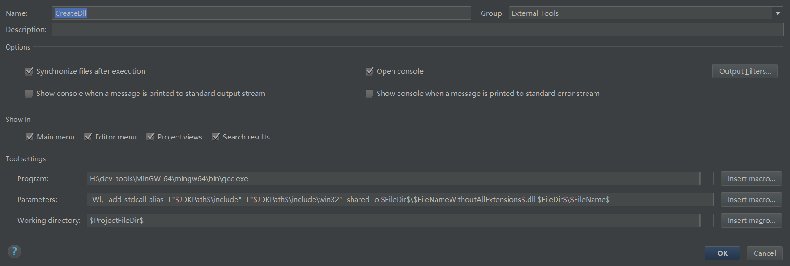

# JNI简介

java平台有一个同于和本地c代码进行交互的API，称为Java本地接口(JNI),使用JNI可以在java代码中调用c代码。

原则上100%的纯java代码是很好的解决方案，这样不再需要考虑跨平台的事情，但是有时候不得不借助其他的原有来完成一个工作。比如应用需要访问的系统特性和设备通过java平台无法实现时
有现成的其他语言实现的库，而发现使用java代码实现将会耗费很多的时间与精力。

什么时候使用JNI：

- 应用需要访问系统特性和设备，而无发通过java实现
- 需要实现的功能已经有了c/c++的实现，而通过java重新编写需要耗费比较大的资源

## 准备

- MinGW(64位)gcc工具
- `javah`命令用于根据class文件生成c头文件
- `javap`可以查看java方法的签名
- `gcc -c HelloC.c  -I "H:\dev_tools\java8\include" -I "H:\dev_tools\java8\include\win32"`用于编译c代码生成.o库
- `gcc -Wl,--add-stdcall-alias -shared -o HelloC.dll HelloC.o`用于把.o库转换成windows平台的dll库
- `gcc -Wl,--add-stdcall-alias -I "H:\dev_tools\java8\include" -I "H:\dev_tools\java8\include\win32" -shared -o helloC.dll HelloC.c`直接生成.dll库

---
# 1 Java调用C

1. 编写native方法
2. 生成头文件
3. 编写c代码
4. 编译c代码
5. 静态代码块中使用`System.loadLibrary`方法加载编译好的c库(不需要加后缀名)

## java方法与c方法编写规范：

                ztiany.JNIMain.java中的方法
                public static native void helloC();
                
                此时c文件在中的方法应该写成：
                JNIEXPORT void JNICALL Java_ztiany_JNIMain_helloC(JNIEnv * env, jclass cls){
                
1. 使用完整的Java方法名:`ztiany.JNIMain.helloC`
2. 用下划线代替所有的`.`符号，并加上Java前缀:`Java_ztiany_JNIMain_helloC`
3. 如果类名含有非ASCII字母或者数字(比如`_,$`)或是大于`\u007F`的unicode字符，用`_0xxxx`来代替他们，xxxx是该字符的Unicode值的4个十六进制数序列

当然这只是规则，我们可以使用javah命名来自动生成头文件。
 
每个被调用的方法至少有两参数:

- JNIEnv指针类型,env是jninativeinterface的指针,jninativeinterface是指向函数指针表的指针
- jclass表示调用此方法的类(静态方法)
- jobject表示调用此方法的java对象(非静态方法)

如果有其他的方法参数，则参数按顺序加在上面两个参数后面
  
  
## 本地库初始化时的回调方法

            //在该库被加载时调用
            jint JNI_OnLoad(JavaVM* vm,void* reserved){
                    printf("on load\n");
                    return JNI_VERSION_1_2;//返回JVM的最低版本
            }
            
            //在虚拟机关闭时调用：实践中此方法并没有被调用
            void JNI_OnUnload(JavaVM* vm,void* reserved){
                        printf("on unload\n");
            }

# 2 Java与C数据类型对应

 java调用c/c++需要注意不同数据类型的传递，以及在c中如何处理这些不同类型的数据并返回。

Java语言|C语言|位
---|---|---
boolean|jboolean|unsigned 8 bits
byte|jbyte|signed 8 bits
char|jchar|	unsigned 16 bits
short|jshort|signed 16 bits
int|jint|signed 32 bits
long|jlong|signed 64 bits
float|jfloat|32 bits
double|jdouble|64 bits

jvalue类型:
 
            typedef union jvalue {
                jboolean    z;
                jbyte       b;
                jchar       c;
                jshort      s;
                jint        i;
                jlong       j;
                jfloat      f;
                jdouble     d;
                jobject     l;
            } jvalue;

常用的宏定义常量
    
        JNIEXPORT 和 JNICALL 都是宏定义，用于指定JNI函数和本地方法实现之间的调用和链接规则。必须将JNIEXPORT放在函数的返回类型之前，将JNICALL放在函数名称与返回类型之间
        
        JNI_FALSE = 0 ,JNI_TRUE = 1 是定义jboolean类型的两个常量
            
        JNI_OK表示JNI函数成功返回， JNI_ERR有时用于表示错误。
        
        JNI_COMMIT与JNI_ABORT两个常量被用于函数中，释放本地拷贝的基本类型数组。
             JNI_COMMIT 强制要求本地数组数据拷贝至JVM中对应的数组，
             JNI_ABORT则释放本地数组占用的内存空间，并且不作为新返回数据拷贝至JVM中对应的数组。

# 3 访问数组元素

Java中所有的数组类型都有相对应的C语言类型：

Java语言|C语言
---|---
boolean[]|jbooleanArray
byte[]|jbyteArray
char[]|jcharArray
short[]|jshortArray
int[]|jintArray
long[]|jlongArray
float[]|jfloatArray
double[]|jdoubleArray
Object[]|jobjectArray

继承关系：

                       
## 相关方法

通用方法

         GetArrayLength 获取数组的长度

基本数据类型的数组(Xxx表示基本数据类型)

        jXxxArray     (*NewXxxArray)(JNIEnv*, jsize); 创建Xxx类型数组

        jXxx*   (*GetXxxArrayElements)(JNIEnv*, jXxxArray, jboolean*);` 获取指向一个数组起始元素的C指针，最后一个参数jboolean，当数组指针是指向一个副本时，
        会被赋值为JNI_TRUE,否则为JNI_FALSE,如果不关心这个结果，可以传入NULL
        
        void      (*ReleaseXxxArrayElements)(JNIEnv*, jXxxArray,jXxx*, jint);` 通知虚拟机不再不要通过指针指向数组，
        另一方面GetXxxArrayElements获取的指针可能只想你一个副本，只有调用相应的ReleaseXxxArrayElements时，所做的改变才能反映到在原数组中。
        方法的最后一个参数jint表示模式，0表示更新数组后释放elements缓存，JNI_COMMIT更新数组后不释放元素，JNI_ABORT不更新数组释放元素
        
        GetXxxArrayRegion 将Java数组复制到C数组中
        SetXxxArrayRegion 将C数组复制到数组Java中

对象数组：

          GetObjectArrayElement 访问对象数组的元素
          SetObjectArrayElement 访问对象数组的元素
          NewObjectArray 创建对象数组

NIO：

        jobject NewDirectByteBuffer(void* address, jlong capacity)
        void* GetDirectBufferAddress(jobject buf)
        jlong GetDirectBufferCapacity(jobject buf)

# 3 处理字符串类型

jni中有两组操作字符串的函数：

1. 把Java字符串转换成**改良UTF-8**字节序列
2. 把Java字符串转换成**UTF16**数值数组，也就是jchar数组

NewStringUTF可以创建一个新的字符串，但是读取jstring对象的内容，需要使用GetStringUTFChars函数，该函数返回
一个指向描述字符串的*改良UTF-8**字符的指针，可以得到实际的Java字符串的字符指针，因为Java字符串时不可变的
，所以不要试图将数据写入该字符数组，同时使用完后，应该调用ReleaseStringUTFChars释放内存。

## 相关方法

改良UTF-8

        jstring NewStringUTF(const char* bytes) 
        jsize GetStringUTFLength(jstring string)
        
        const char* GetStringUTFChars(jstring string, jboolean* isCopy)
        void ReleaseStringUTFChars(jstring string, const char* utf)
        
        const jchar* (*GetStringChars)(JNIEnv*, jstring, jboolean*);
        void        (*ReleaseStringChars)(JNIEnv*, jstring, const jchar*);
        
        void GetStringUTFRegion(jstring str, jsize start, jsize len, char* buf)

UNICODE

        
        jstring NewString(const jchar* unicodeChars, jsize len)
        jsize GetStringLength(jstring string)
        
        const jchar* GetStringChars(jstring string, jboolean* isCopy)
        void ReleaseStringChars(jstring string, const jchar* chars)
        
        void GetStringRegion(jstring str, jsize start, jsize len, jchar* buf)

# 4 C调用Java

C调用Java包括以下内容：

- 获取Class
- 访问字段(静态和非静态)
- 访问方法(静态和非静态)
- 访问构造方法

编码签名

描述符|java类型
---|---
Z | boolean
B | byte
C | char
S | short
I | int
J | long
F | float
D | double
Lclassname | 类的类型
[ | 表示数组

可以使用`javap -s -p classname`查看方法和字段签名

示例：
            
            字段：
            "Ljava/lang/String;" 对应 String
            "[I" 对应 int[]
            "[Ljava/lang/Object;" 对应 Object[]
            方法：
            "()Ljava/lang/String;" 对应 String f();
            "(ILjava/lang/Class;)J" 对应 long f(int i, Class c);
            `"([B)V" 对应 String(byte[] bytes);

构造方法的方法名为`<init>`

# 5 错误处理

当Java调用C发生异常时如何处理？C语言没有异常，必须调用Throw或者ThrowNew函数创建一个异常，当本地方法
退出时,Java虚拟机就会抛出该异常。

                    
                    //方式1
            	 	jclass class_EOF = (*env)->FindClass(env,"java/io/EOFException");
            	 	jmethodID id = (*env)->GetMethodID(env,class_EOF,"<init>", "()V");
            	 	jthrowable obj_exc = (*env)->NewObject(env,class_EOF,id);
            	 	if(JNI_TRUE){
            	 			(*env)->Throw(env,obj_exc);
            	 			return;
            	 	}
                    //方式2
            	 	(*env)->ThrowNew(env,(*env)->FindClass(env,"java/io/EOFException"), "Unexpected end of file");
            
上面两种方式仅仅是发布异常，他们不会中断本能地方法的控制流，只有当方法返回时，Java虚拟机才会抛出异常，所以一般应该在其后面加上return让方法立即返回。

其次当c调用Java时，java代码也有可能发生异常，本地方法如何处理呢？

        	jthrowable jthrow =  (*env)->ExceptionOccurred(env);  当java层抛出异常时，则此方法返回抛出的异常，否则返回NULL
        	jboolean jbool = (*env)->ExceptionCheck(env); 当java层抛出异常时，此方法返回TRUE
        	(*env)->ExceptionClear(env); 关闭异常

# 6 动态注册方法

    //C的方法编写方法
    static jstring nativeDynamicRegFromJni(JNIEnv *env, jobject obj)
    {
        return (*env) -> NewStringUTF(env, "动态注册调用成功");
    }
    //JNINativeMethod是一个结构体，这里初始化了一个JNINativeMethod数组，正是这个，可以动态调用任意 native 方法
    JNINativeMethod nativeMethod[] = {{"dynamicRegFromJni", "()Ljava/lang/String;", (void*)nativeDynamicRegFromJni}};
    //此方法在jni库被加载时有JVM调用
    JNIEXPORT jint JNICALL JNI_OnLoad(JavaVM *jvm, void *reserved)
    {
        JNIEnv *env;
        if ((*jvm) -> GetEnv(jvm, (void**) &env, JNI_VERSION_1_4) != JNI_OK)
        {
            return -1;
        }
    //获取class
    jclass clz = (*env) -> FindClass(env, "ztiany/RegisterMethod");
    //通过RegisterNatives注册方法
    (*env) -> RegisterNatives(env, clz, nativeMethod, sizeof(nativeMethod) / sizeof(nativeMethod[0]));
    return JNI_VERSION_1_4;
}

# 7 C++注意

1. 使用c++实现本地方法，必须将实现本地方法的函数声明为`extern "C"`，用以阻止C++编译器混编方法名
2. c++对JNI函数的方法比c要简单，如`env->NewStringUTF(str)`即可实现NewStringUTF函数的调用

    

# 引用

- [IntelliJ IDEA平台下JNI编程](http://blog.csdn.net/huachao1001/article/details/53906237)
- [极客学院：JNI/NDK 开发指南](http://wiki.jikexueyuan.com/project/jni-ndk-developer-guide/Readme.md)

#  排错

1. `Can't load IA 32-bit .dll on a AMD 64-bit platform`:MinGW版本错误，应该使用64位的。

# IDEA技巧

使用ExternalTools自动生成头文件和编译c代码：Setting-->Tool-->ExternalTools

`-classpath $OutputPath$ -d $FileDir$ $FileClass$`

`-Wl,--add-stdcall-alias -I "$JDKPath$\include" -I "$JDKPath$\include\win32" -shared -o $FileDir$\$FileNameWithoutAllExtensions$.dll $FileDir$\$FileName$`
