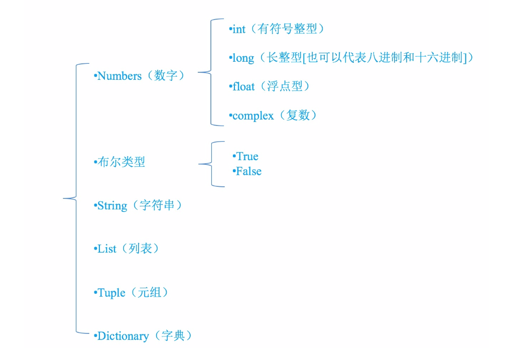

# 数据类型

Python有以下数据类型



定义数据时不需要加任何关键字，直接定义即可。

使用`type`函数可以获取变量大数据类型:

```python
a = 3
print(type(a))
```

# 标识符

Python的标示符由字母、下划线和数字组成，且数字不能开头，python中的标识符是区分大小写的


# 命名规则

- ⻅名知意
- 驼峰命名法


# Python中的关键字

        False               def                 if                  raise
        None                del                 import              return
        True                elif                in                  try
        and                 else                is                  while
        as                  except              lambda              with
        assert              finally             nonlocal            yield
        break               for                 not
        class               from                or
        continue            global              pass

可以通过以下命令进行查看当前系统中python的关键字

```python
import keyword
print(keyword.kwlist)
```
