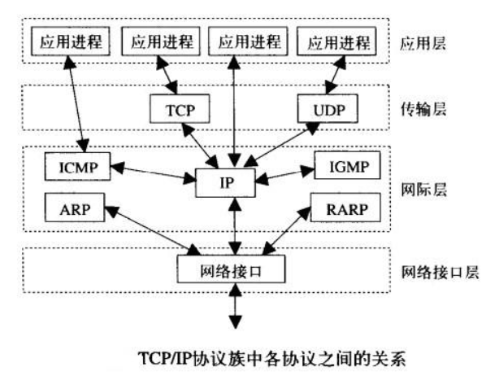
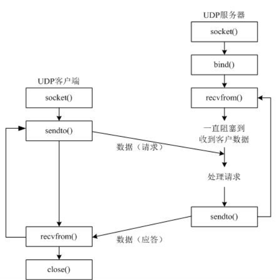
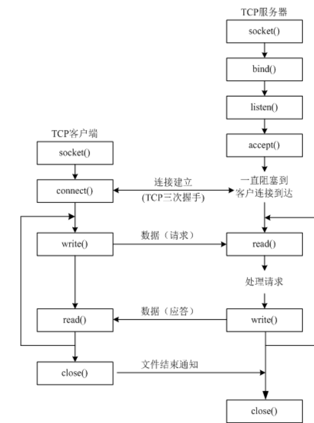
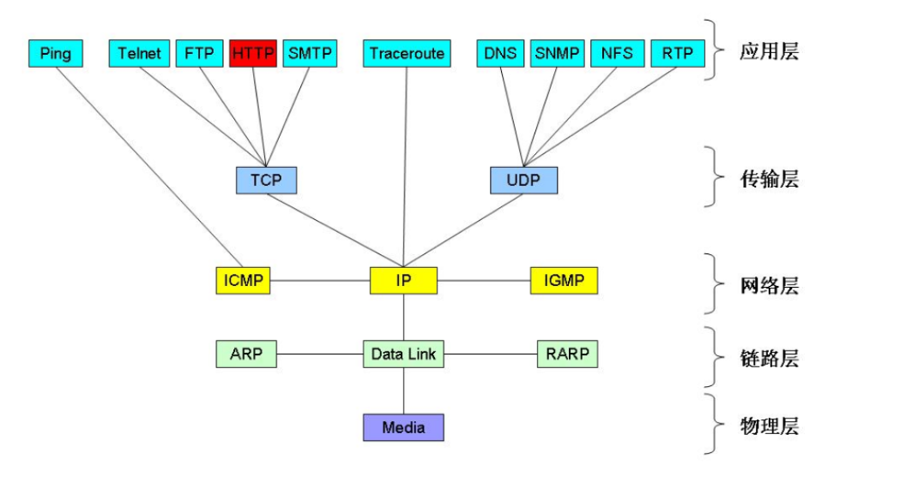
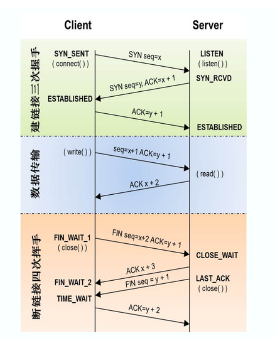
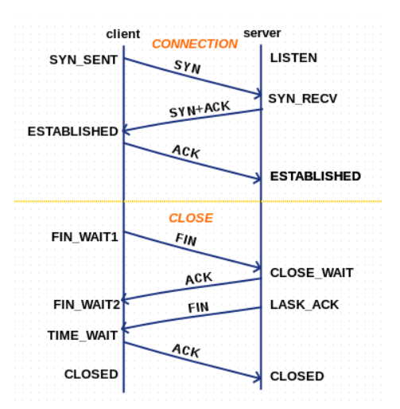
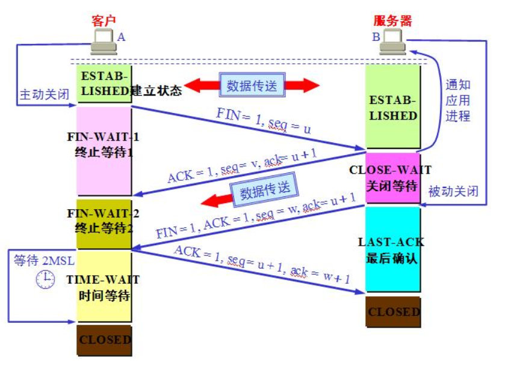
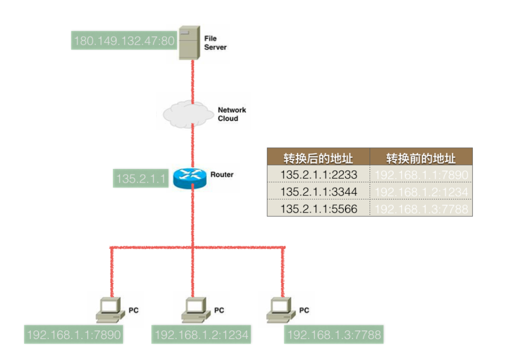

# 网络通信

---
## 1 网络基础知识

什么是协议：有的说英语，有的说中文，有的说德语，说同一种语言的人可以交流，不同的语言之间就不行了为了解决不同种族人之间的语言沟通障碍，
现规定国际通用语言是英语，这就是一个规定，这就是协议，现在的生活中，不同的计算机只需要能够联网（有线无线都可以）那么就可以相互进行传递数据
那么不同种类之间的计算机到底是怎么进行数据传递的呢？就像说不同语言的人沟通一样，只要有一种大家都认可都遵守的协议即可。

### TCP/IP协议(族)

早期的计算机网络，都是由各厂商自己规定一套协议，IBM、Apple和Microsoft都有各自的网络协议，互不兼容，为了把全世界的所有不同类型的计算机都连接起来，
就必须规定一套全球通用的协议，为了实现互联网这个目标，互联网协议簇（Internet Protocol Suite）就是通用协议标准。现在网络通讯使用的协议是TCP/IP协议族。



- 网际层也称为：网络层
- 网络接口层也称为：链路层

### 端口

端口号用于唯一标识系统中运行的一个进程。端口是通过端口号来标记的，端口号只有整数，范围是从0到65535，
从0到1023一般都是系统级端口，一般的应用程序应该使用1024到65535的端口号。用`netstat －an`查看端口状态

### ip地址

ip地址：用来在网络中标记一台电脑的一串字符

### ip地址的分类


A类IP地址：一个A类IP地址由1字节的网络地址和3字节主机地址组成，网络地址的最高位必须是“0”：

- 地址范围`1.0.0.1-126.255.255.254`
- 二进制表示为：`00000001 00000000 00000000 00000001 - 01111110 11111111 11111111 11111110`
- 可用的A类网络有126个，每个网络能容纳1677214个主机

B类IP地址：一个B类IP地址由2个字节的网络地址和2个字节的主机地址组成，网络地址的最高位必须是“10”：

- 地址范围`128.1.0.1-191.255.255.254`
- 二进制表示为：`10000000 00000001 00000000 00000001 - 10111111 11111111 11111111 11111110`
- 可用的B类网络有16384个，每个网络能容纳65534主机

C类IP地址：一个C类IP地址由3字节的网络地址和1字节的主机地址组成，网络地址的最高位必须是“110”：

- 范围`192.0.1.1-223.255.255.254`
- 二进制表示为: `11000000 00000000 00000001 00000001 - 11011111 11111111 11111110 11111110`
- C类网络可达2097152个，每个网络能容纳254个主机

D类地址用于多点广播：D类IP地址第一个字节以“1110”开始，它是一个专门保留的地址：

- 它并不指向特定的网络，目前这一类地址被用在多点广播（MultiCast）中
- 多点广播地址用来一次寻址一组计算机
- 地址范围`224.0.0.1-239.255.255.254`

E类IP地址：

- 以“1111”开始，为将来使用保留
- E类地址保留，仅作实验和开发用


私有ip：在这么多网络IP中，国际规定有一部分IP地址是用于我们的局域网使用，也就是属于私网IP，不在公网中使用的，它们的范围是：

    10.0.0.0～10.255.255.255
    172.16.0.0～172.31.255.255
    192.168.0.0～192.168.255.255


IP地址`127．0．0．1~127．255．255．255`用于回路测试，如：`127.0.0.1`可以代表本机IP地址，用`http://127.0.0.1`就可以测试本机中配置的Web服务器。


每一个IP地址包括两部分：网络地址和主机地址，比如一个C类地址：`192.168.155.1`，子网掩码为`255.255.255.0`，则

- 其中`192.168.155.0`和`192.168.155.255`不允许使用
- 经过与子网掩码计算后可得`192.168.155.0`为网络号
- `192.168.155.255`是广播地址，广播地址(Broadcast Address)是专门用于同时向网络中所有工作站进行发送的一个地址
- 一个C类地址最多容纳254个地址，即1-254


### 子网掩码

要想理解什么是子网掩码，就需要了解IP地址的构成。互联网是由许多小型网络构成的，每个网络上都有许多主机，这样便构成了一个有层次的结构。
IP地址在设计时就考虑到地址分配的层次特点，将每个IP地址都分割成网络号和主机号两部分，以便于IP地址的寻址操作。

IP地址的网络号和主机号各是多少位呢？如果不指定，就不知道哪些位是网络号、哪些是主机号，这就需要通过子网掩码来实现。子网掩码不能单独存在，它必须结合IP地址一起使用。

子网掩码只有一个作用，就是**将某个IP地址划分成网络地址和主机地址两部分，子网掩码的设定必须遵循一定的规则。**

与IP地址相同，子网掩码的长度也是32位，

- 左边是网络位，用二进制数字“1”表示；
- 右边是主机位，用二进制数字“0”表示。

假设IP地址为`192.168.1.1`子网掩码为`255.255.255.0`。

            将IP地址和子网掩码换算为二进制，子网掩码连续全1的是网络地址，后面的是主机地址
        
            其中，“1”有24个，代表与此相对应的IP地址左边24位是网络号； “0”有8个，代表与此相对应的IP地址右边8位是主机号。
            
            将IP地址和子网掩码进行与运算，结果是网络地址（即主机号全0是网络地址）
            将子网掩码取反再与IP地址按位与（&）后得到的结果即为主机部分
            将运算结果中的网络地址不变，主机地址变为1，结果就是广播地址
            
            
            这样，子网掩码就确定了一个IP地址的32位二进制数字中哪些是网络号、哪些是主机号。
            这对于采用TCP/IP协议的网络来说非常重要，只有通过子网掩码，才能表明一台主机所在的子网与其他子网的关系，使网络正常工作。

常用子网掩码是`255.255.255.0`的网络：最后面一个数字可以在0~255范围内任意变化，因此可以提供256个IP地址。
但是实际可用的IP地址数量是256-2，即254个，因为主机号不能全是“0”或全是“1”。

主机号全为0，表示网络号，主机号全为1，表示网络广播。

子网掩码应该根据网络的规模进行设置。如果一个网络的规模不超过254台电脑，采用`255.255.255.0`作为子网掩码就可以了，现在大多数局域网都不会超过这个数字，
因此`255.255.255.0`是最常用的IP地址子网掩码；假如在一所大学具有1500多台电脑，这种规模的局域网可以使用`255.255.0.0`。

### 网关

网关(Gateway)又称网间连接器、协议转换器。默认网关在网络层上以实现网络互连，是最复杂的网络互连设备，仅用于两个高层协议不同的网络互连。网关的结构也和路由器类似，
不同的是互连层。网关既可以用于广域网互连，也可以用于局域网互连，网关实质上是一个网络通向其他网络的IP地址。

比如有网络A和网络B，网络A的IP地址范围为`192.168.1.1~192. 168.1.254`，子网掩码为`255.255.255.0`；网络B的IP地址范围为`192.168.2.1~192.168.2.254`，子网掩码为`255.255.255.0`。
在没有路由器的情况下，两个网络之间是不能进行TCP/IP通信的，即使是两个网络连接在同一台交换机（或集线器）上，TCP/IP协议也会根据子网掩码`255.255.255.0`判定两个网络中的主机处在不同的网络里。
而要实现这两个网络之间的通信，则必须通过网关。如果网络A中的主机发现数据包的目的主机不在本地网络中，就把数据包转发给它自己的网关，再由网关转发给网络B的网关，网络B的网关再转发给网络B的某个主机。
所以说，只有设置好网关的IP地址，TCP/IP协议才能实现不同网络之间的相互通信。那么这个IP地址是哪台机器的IP地址呢？网关的IP地址是具有路由功能的设备的IP地址，具有路由功能的设备有路由器、启用了路由协议的服务器、代理服务器。

---
## 2 Socket

socket(简称 套接字) 是进程间通信的一种方式，它与其他进程间通信的一个主要不同是：它能实现不同主机间的进程间通信，我们网络上各种各样的服务大多都是基于 Socket 来完成通信的，
例如我们每天浏览网页、QQ 聊天、收发 email 等等。

在 Python 中 使用socket 模块的函数 socket 就可以完成：

```
"""
函数 socket.socket 创建一个 socket，返回该 socket 的描述符，该函数带有两个参数
    Address Family：可以选择 AF_INET（用于 Internet 进程间通信） 或者 AF_UNIX（用于同一台机器进程间通信）,实际工作中常用AF_INET
    Type：套接字类型，可以是 SOCK_STREAM（流式套接字，主要用于 TCP 协议）或者 SOCK_DGRAM（数据报套接字，主要用于 UDP 协议）
"""
socket.socket(AddressFamily, Type)
```

---
## 3 UDP

UDP即用户数据报协议，是一个无连接的简单的面向数据报的运输层协议。UDP不提供可靠性，它只是把应用程序传给IP层的数据报发送出去，但是并不能保证它们能到达目的地。
由于UDP在传输数据报前不用在客户和服务器之间建立一个连接，且没有超时重发等机制，故而传输速度很快。UDP是一种面向无连接的协议，每个数据报都是一个独立的信息，
包括完整的源地址或目的地址，它在网络上以任何可能的路径传往目的地，因此能否到达目的地，到达目的地的时间以及内容的正确性都是不能被保证的。

UDP是面向无连接的通讯协议，UDP数据包括目的端口号和源端口号信息，由于通讯不需要连接，所以可以实现广播发送。 UDP传输数据时有大小限制，
每个被传输的数据报必须限定在64KB之内。 UDP是一个不可靠的协议，发送方所发送的数据报并不一定以相同的次序到达接收方。



---
### TFTP协议介绍

TFTP（Trivial File Transfer Protocol，简单文件传输协议），是TCP/IP协议族中的一个用来在客户端与服务器之间进行简单文件传输的协议，TFTP服务器默认监听69号端口，特点：

- 简单
- 占用资源小
- 适合传递小文件
- 适合在局域网进行传递
- 端口号为69
- 基于UDP实现

### UDP广播

只有UDP才能使用广播

--- 
## 4 TCP

tcp通信模型中，在通信开始之前，一定要先建立相关的链接，才能发送数据，类似于生活中，"打电话""



---
## 5 网络通讯过程

- DHCP协议：动态配置IP
- 使用Packet Tracer可以模拟网络中的通讯过程

### 集线器(hub)

集线器，类似USB转接头

 - 集线器能够完成多个电脑的链接
 - 每个数据包的发送都是以广播的形式进行的，容易堵塞网络
    
### 网络交换机(switch)

网络交换机（又称“网络交换器”），是一个扩大网络的器材，能为子网络中提供更多的连接端口，以便连接更多的计算机，
具有性能价格比高、高度灵活、相对简单、易于实现等特点 以太网技术已成为当今最重要的一种局域网组网技术，网络交换机也就成为了最普及的交换机

使用交换机的通信过程：如果PC不知目标IP所对应的的MAC，那么pc会先发送arp广播，得到对方的MAC地址，然后再进行数据的传送

问题：

1. 两台计算机之间能通讯的前提是什么？在同一网段内
2. 多态计算机之间为什么不能把网线剪开链接在一起？数据是通过电信号传输的
3. 链接多台计算机的hub(集线器)有什么作用？实现多台计算机链接在一起，组成小型网络
4. 集线器与交换机的区别？集线器使用以广播形式发送数据，交换机有一个学习过程，开始以广播发送数据，之后是单播。

### ARP和ICMP协议

TCP/IP协议族把网络分为四层：

- 应用层：原始数据
- 传输层：加上端口
- 网络层：网络层协议有`icmp、arp、rarp、igmp、ip`
- 链路层：加上MAC地址

端口号、ip地址、MAC地址是通讯的必要因素，否则通讯的双方无法确认对方。在整个通讯过程中，ip地址不会改变，而MAC地址在没两台设备之间会改变一次，
所有ip地址是一种逻辑地址，而MAC地址是是真实的物理地址，用于标记实际转发数据时的设备地址。举个例子，老师要把一个东西交给坐在最后面的A同学，
但是老师不需要直接交给他，而是把东西交给坐在前面的同学，然后同学们一个接一个传递这个东西，最后把东西传递给了最后面的A同学，在这个过程中，
A同学就是那个IP，而每个同学的地址可以理解为MAC地址。整个过程中IP没变，每一段的传输，MAC都会改变。

各种协议的作用：

- ping使用的是icmp协议
- arp协议用于根据ip获取MAC地址
- rarp协议根据MAC地址找ip地址


那么数据链路层在收到数据时是把数据交给arp还是ip呢？在网络层发送数据时，会加上一个type，比如type为0x806则交给arp，type为0x800则交给给ip。

在交换机的组成的网络中，一台计算机A ping一台从未通讯过的另一台计算机B 的过程时怎样的呢？



A首先只知道B的IP，于是先使用arp协议发送数据包，并把数据包的MAC地址设置为`FFFF-FFFF-FFFF`广播MAC地址，数据发送到路由器后，路由器会以广播的形式
发送这个数据包，连接这个路由器的所有其他计算机都会收到收到这个数据包，但是只有IP地址匹配的计算机才会接收这个数据包(其他计算机都会丢弃)，接收数据包的计算机
会把自己的MAC地址发送给A，A得到B的MAC地址之后进行一对一的通讯。


arp缓存表：每台pc都会有一个arp缓存表，用来记录IP所对应的的MAC地址。使用`arp -a`可以查看pc上的arp缓存表，使用`arp -d`用于删除arp缓存表

```shell
λ arp -a

接口: 192.168.56.1 --- 0xe
  Internet 地址         物理地址              类型
  192.168.56.255        ff-ff-ff-ff-ff-ff     静态
  224.0.0.2             01-00-5e-00-00-02     静态
  224.0.0.22            01-00-5e-00-00-16     静态
  224.0.0.251           01-00-5e-00-00-fb     静态
  224.0.0.252           01-00-5e-00-00-fc     静态
  239.255.255.250       01-00-5e-7f-ff-fa     静态

接口: 192.168.180.2 --- 0xf
  Internet 地址         物理地址              类型
  192.168.180.255       ff-ff-ff-ff-ff-ff     静态
  224.0.0.2             01-00-5e-00-00-02     静态
  224.0.0.22            01-00-5e-00-00-16     静态
  224.0.0.251           01-00-5e-00-00-fb     静态
  224.0.0.252           01-00-5e-00-00-fc     静态
  239.255.255.250       01-00-5e-7f-ff-fa     静态
```

### 路由器

TCP/IP规定，不允许跨网络直接通讯。

路由器（Router）又称网关设备（Gateway）是用于连接多个逻辑上分开的网络，所谓逻辑网络是代表一个单独的网络或者一个子网。当数据从一个子网传输到另一个子网时，
可通过路由器的路由功能来完成具有判断网络地址和选择IP路径的功能。

路由器上至少存在两个网卡，于是可以和至少连接到两个逻辑网络，两个逻辑网络可以通过路由器进行通讯。不同逻辑网络之间的通讯需要配置默认网关，当发送的ip地址不在同一网段内时，就会把数据发送给默认网关(比如一个路由器)


- 不在同一网段的pc，需要设置默认网关才能把数据传送过去 通常情况下，都会把路由器默认网关
- 当路由器收到一个其它网段的数据包时，会根据“路由表”来决定，把此数据包发送到哪个端口；路由表的设定有静态和动态方法
- 每经过一次路由器，那么TTL值就会减一
- DNS服务器用来解析出IP（类似电话簿）
- Default Gateway（默认网关）用来对顶，当发送的数据包的目的ip不是当前网络时，此数据包包转发的目的ip
- 在路由器中路由表指定数据包的”下一跳”的地址


### 一次网络请求的过程

假设已经配置好默认网关和dns服务器，以访问abc.com为例。

1. 先要解析除abc.com对应的ip地址
    1. 通过arp获取默认网关的MAC地址
    2. 阻止数据，发送给默认网关(ip时dns服务器的ip，MAC地址是默认网关的ma地址)
    3. 默认拥有转发数据的能力，把数据转发给路由器
    4. 路由器根据自己的路由协议，来选择一个合适的较快的路径，转发数给目的网关
    5. 目的网关(dns服务器所在的网关)把数据转发给dns服务器
    6. dns服务器查询解析出来abc.com对应的ip地址，原路返回给请求这个域名的client
2. 得到abc.com对用的ip地址，之后发送三次握手，进行连接
3. 使用http协议发送请求给web服务器
4. web服务器收到数据请求之后，通过查询自己服务器得到对用的结果，原路返回给client
5. client上浏览器收到数据后，进行渲染
6. 断开tcp连接，即四次挥手


### TCP三次握手四次挥手



TCP要求，通讯的双方，每一次收到数据后，都要向发送端发送ACK确认收到的信息，否则发送方会任务数据没有送达目标地址，会进行重试。

### TCP的十种状态




- established：确定的；已制定的，已建立的
- 当一端收到一个FIN，内核让read返回0来通知应用层另一端已经终止了向本端的数据传送
- 发送FIN通常是应用层对socket进行关闭的结果

2MSL问题，MSL表示一个数据包在网络种存活的最长时间，2MSL是指在TCP四次挥手时，客户端在发送最后一次ACK信号后，需要等待2MSL的时间再关闭，为了确保服务器已经
收到客户端的ACK信号，如果客户端的ACK信号发送失败(最长为MSL时间)，则服务器会再一次重试(最长为MSL时间)，所以最坏时长为2MSL。



### TCP长连接和短连接

TCP在真正的读写操作之前，server与client之间必须建立一个连接，当读写操作完成后，双方不再需要这个连接时它们可以释放这个连接，
连接的建立通过三次握手，释放则需要四次握手，所以说每个连接的建立都是需要资源消耗和时间消耗的。

TCP短连接：

1. client 向 server 发起连接请求
1. server 接到请求，双方建立连接
1. client 向 server 发送消息
1. server 回应 client
1. 一次读写完成，此时双方任何一个都可以发起 close 操作

在第 步骤5中，一般都是 client 先发起 close 操作。当然也不排除有特殊的情况。从上面的描述看，短连接一般只会在 client/server 间传递一次读写操作！

TCP长连接：

1. client 向 server 发起连接
1. server 接到请求，双方建立连接
1. client 向 server 发送消息
1. server 回应 client
1. 一次读写完成，连接不关闭
1. 后续读写操作...
1. 长时间操作之后client发起关闭请求

TCP长/短连接的优点和缺点：

- 长连接可以省去较多的TCP建立和关闭的操作，减少浪费，节约时间。对于频繁请求资源的客户来说，较适用长连接。
- client与server之间的连接如果一直不关闭的话，会存在一个问题，随着客户端连接越来越多，server早晚有扛不住的时候，这时候server端需要采取一些策略，
    - 关闭一些长时间没有读写事件发生的连接，这样可以避免一些恶意连接导致server端服务受损；
    - 如果条件再允许就可以以客户端机器为颗粒度，限制每个客户端的最大长连接数，这样可以完全避免某个蛋疼的客户端连累后端服务。
- 短连接对于服务器来说管理较为简单，存在的连接都是有用的连接，不需要额外的控制手段。但如果客户请求频繁，将在TCP的建立和关闭操作上浪费时间和带宽。

TCP长/短连接的应用场景

- 长连接多用于操作频繁，点对点的通讯，而且连接数不能太多情况。
- 而像WEB网站的http服务一般都用短链接，因为长连接对于服务端来说会耗费一定的资源。


### Python TCP Socket listen队列长度

```python
from socket import *
from time import sleep

# 创建socket
tcpSerSocket = socket(AF_INET, SOCK_STREAM)

# 绑定本地信息
address = ('', 7788)
tcpSerSocket.bind(address)

connNum = int(input("请输入要最大的链接数:"))

# 使用socket创建的套接字默认的属性是主动的，使用listen将其变为被动的，这样就可以接收别人的链接了
tcpSerSocket.listen(connNum)

while True:

    # 如果有新的客户端来链接服务器，那么就产生一个新的套接字专门为这个客户端服务器
    newSocket, clientAddr = tcpSerSocket.accept()
    print (clientAddr)
    sleep(1)
```

`tcpSerSocket.listen(connNum)`中connNum表示半连接数和已建立连接的最大数量：

- 半连接：TCP三次握手服务器收到SYN信号
- 已连接：TCP三次握手完成
- 如果服务器调用accept创建了一个客户端socket，那么linux底层的半连接与已连接的中客户端个数就会减一
- 如果当前已建立链接数和半链接数以达到设定值，那么新客户端就不会connect成功，而是等待服务器


### 常见网络攻击

- 半连接攻击：只发送TCP三次握手中的第一次SYN信号
- DNS服务器劫持：hack DNS服务器
- DNS欺骗：分配假的DNS服务器
- ARP攻击，篡改MAC地址，中间人攻击

如何攻击：python 原始套接字

### 家庭上网解析

电话线-->调制解调器(俗称猫，电信号->网络信号)->路由器->PC

路由器：

- WAN，外网接口
- LAN，内网接口
- 路由表，记录本地PC的ip、端口的映射
- 家庭PC只能主动访问外网，而不能被外网访问，不过可以使用花生壳映射。

NAT：网络地址转换器



---
## 6 并发服务器

- 单进程服务器
- 多进程服务器
- 多线程服务器
- 单进程非阻塞服务器
- 单进程select非阻塞服务器
- 单进程epoll非阻塞服务器
- 单进程协程服务器

---
## 7 WSGI

WSGI(Python Web Server Gateway Interface)：WSGI允许开发者将选择web框架和web服务器分开。可以混合匹配web服务
器和web框架，选择⼀个适合的配对。⽐如,可以在Gunicorn 或者Nginx/uWSGI 或者 Waitress上运⾏ Django, Flask, 或 Pyramid。
真正的混合匹配，得益于WSGI同时⽀持服务器和架构

web服务器必须具备WSGI接⼝，所有的现代Python Web框架都已具备WSGI接⼝，它让你不对代码作修改就能使服务器和特点的web框架协同⼯作。
WSGI由web服务器⽀持，⽽web框架允许你选择适合⾃⼰的配对，但它同样对于服务器和框架开发者提供便利使他们可以专注于⾃⼰偏爱的领域和专⻓
⽽不⾄于相互牵制。其他语⾔也有类似接⼝：Java有Servlet API，Ruby 有Rack。

WSGI接⼝定义⾮常简单，它只要求Web开发者实现⼀个函数，就可以响应HTTP请求。

```python
# 是符合WSGI标准的⼀个HTTP处理函数
def application(environ, start_response):
    start_response('200 OK', [('Content-Type', 'text/html')])
    return 'Hello World!'
```

- environ：⼀个包含所有HTTP请求信息的dict对象；
- start_response：⼀个发送HTTP响应的函数。

整个 application() 函数本身没有涉及到任何解析HTTP的部分，也就是说，把底层web服务器解析部分和应⽤程序逻辑部分进⾏了分离，这样开发
者就可以专⼼做⼀个领域了，application() 函数必须由WSGI服务器来调⽤。


---
## 进阶

- UDP打包与解包——[Python使用struct处理二进制](https://www.cnblogs.com/gala/archive/2011/09/22/2184801.html)
- [tcp的半连接与完全连接队列](https://segmentfault.com/a/1190000008224853)
